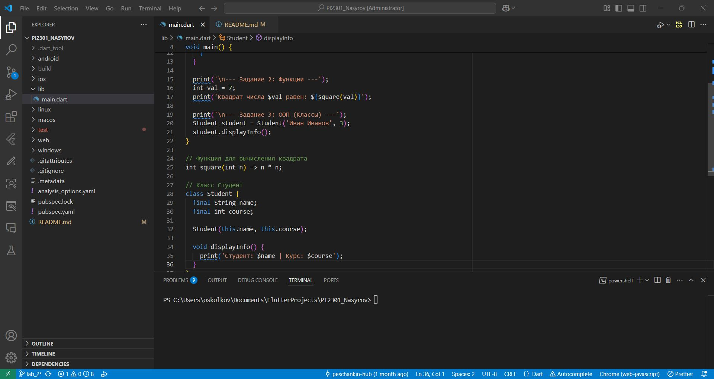

# Репозиторий по дисциплине "Разработка приложений под мобильные устройства"

## Студент
* **Группа:** ПИ2301
* **ФИО:** Насыров Артем Равилевич

---

## Цель репозитория
Данный репозиторий предназначен для хранения и контроля версий лабораторных работ по изучению технологий разработки ПО для мобильных устройств на базе фреймворка **Flutter** и языка **Dart**.

## Структура проекта
В репозитории реализована следующая структура папок:
* `LAB-1` — Установка Flutter и настройка среды.
* `LAB-2` — Работа с системами контроля версий (Git).
* `LAB-3` — Первый проект на Flutter (Инкремент).

---

## Визуализация процесса (Пример)

---

## Используемые инструменты
1. **Git** — распределенная система управления версиями.
2. **GitHub** — платформа для хостинга репозиториев и командной работы.
3. **Flutter SDK** — пакет инструментов для кроссплатформенной разработки.